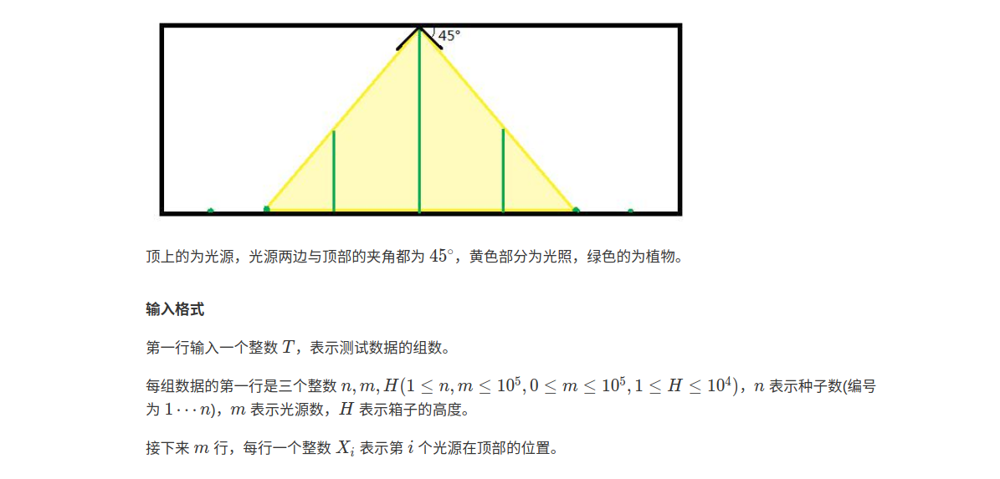

 1000ms  65536K
蒜头是个爱学习的孩子，他总喜欢在生活中做一些小实验，这次蒜头想研究一下光合作用。

蒜头的实验材料有如下几样：神奇的种子，普通的纸箱和一些光源。一开始，蒜头将种子均匀的种在了箱子底部，你可以将其看成 XX 轴，种子的位置为 XX 轴上的点。然后蒜头用纸板将箱子盖住，并在纸板上安装了一些光源（具体见图）。神奇的种子会在有光的情况下一直向上生长直到没光为止。现在蒜头想知道当实验结束时每颗种子的高度是多少？





输出格式

对于每组测试数据，请输出 n 行，每行一个数表示第 i 颗种子的最终高度。


提示:

1.本题可简化为，给每个种子找离它最近的光源横坐标，因为离光源越近，长得越高。

2.找到最近光源后，用相似三角形知识可求得它的最终高度。

3.找离种子最近得光源位置，则需要用到二分查找。

4.注意最近的光源可以在种子的左边也可以在种子的右边。

5.先通过二分查找，找到一个大于等于种子位置的光源位置，即是光源在种子右边的情况。（可用STL的lower_bound）

6.再者判断前一个光源位置，即是光源在种子左边的情况。

7.两个位置求一个max值就是结果。同时注意第一个光源和最后一个光源边界处理。

样例输入
```
2
7 1 2
4
4 4 1
1
2
3
4
```
样例输出
```
0
0
1
2
1
0
0
1
1
1
1
```