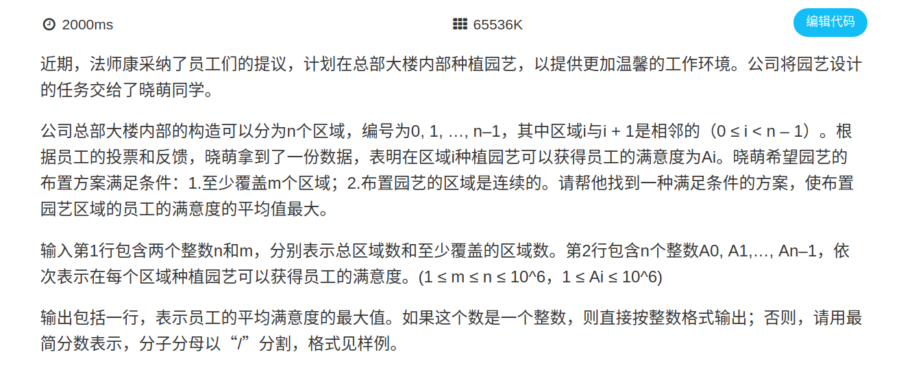

提示:

1.该问题是01分数规划问题。01分数规划学习链接：http://blog.csdn.net/hhaile/article/details/8883652

2.化为01分数规划问题后，二分L，每次在O(n)时间内求一段连续区间使得F(L)值最大，判断是否大于0。

3.二分直至F(L)近似等于0，此时L便是结果。.

4.求F(L)的过程中，顺便记录结束位置，方便后面求GCD。

5.将最终结果分子分母GCD一下即可得到答案。

样例输入
```
5 3
1 8 2 4 8
```
样例输出
```
11/2
```