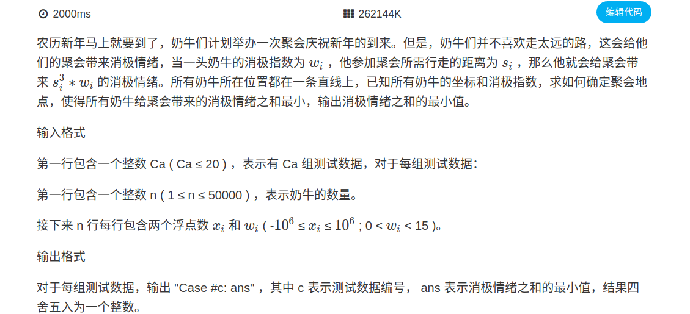

提示:

随着x的增大，答案先减小后增大，呈抛物线状。

所以正解应该是三分答案。

mid1 = (low + high) / 2;

mid2 = (mid1 + high) / 2;

如果f(mid1) < f(mid2),说明极小值要么在mid1的左边，要么在mid1和mid2之间。确定的是一定在mid2的左边。所以将三分范围更新为[low, mid2]。

同理，如果f(mid1)>f(mid2)，三分范围更新为[mid1, high]

循环三分200次，则low和high接近于相等，即是最佳位置。

再求一下f(low)/f(high)就是最终结果。

可以自己画个图帮助理解下~

样例输入
```
1
5
0.9 2
1.4 4
3.1 1
6.2 1
8.3 2
```
样例输出
```
Case #1: 300
```