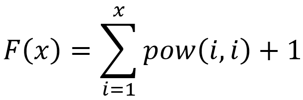

给定x,求F(x)对100000007取余的结果。既然本章学习递归，那么请用递归代替for循环吧。

输入格式：

多组测试样例，最多50组。

每组测试样例给定一个整数x（1≤x≤25000）。

输出格式：

对每个样例，输出一行，代表F(x)对100000007取余的结果。

提示：

本题如果用O(n)算法求幂的话肯定会超时，需要要用到分治的应用：快速幂。

快速幂的复杂度为O(logn)，简单解释如下：

样例输入

3
4
5
样例输出

33
289
3414
查看提示
编辑代码
